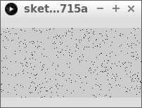
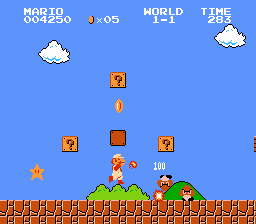

# Lektion 4: `point` och `random`

Under den här lektionen lär vi oss

* vad pixlar är
* hur pixlarna sitter på en skärm
* hur man ritar punkter
* hur man gör slumpmässiga saker



## 4.1. Intro

Din skärm har många rutor som består av pixlar.

 | Pixel = en ruta på skärmen
:-----------------:|:-----------------------------:

\pagebreak

Ju fler pixlar skärmen har desto skarpare blir bilderna.
Du kan se det på gamla/retro datorspel:
de har färre pirxlar vilket gör bilderna kantigare.



\pagebreak

## 4.2. uppgift 1

Kör följande kod:

```processing
void setup()
{
  size(300, 200);
}

void draw()
{
  point(150, 100);
}
```

 | 
:-----:|:--------------------------------------------:
`point(150, 100);` | 'Kära dator, rita ut en punkt i fönstret på platsen `150` pixlar till höger och `100` pixlar nedåt'
`point(150, 100);` | 'Kära dator, rita ut en punkt på koordinat `(150, 100)`'

\pagebreak

### 4.2. Svar


## 4.3. Uppgift 2


Rita ut en till punkt mellan den första punkten och ovansidan av fönstret.

\pagebreak

### 4.3. Svar

```processing
void setup()
{
  size(300, 200);
}

void draw()
{
  point(150, 100);
  point(150, 50);
}
```

## 4.4. Uppgift 3

Den första punkten är exakt i mitten.
Med andra ord, på halva bredden och på halva höjden av fönstret.
Ändra `point(150,100);` till något med `width` och `height`.

\pagebreak

### 4.4. Svar

```processing
void setup()
{
  size(300, 200);
}

void draw()
{
  point(width / 2, height / 2);
  point(150, 50);
}
```

 | 
:-----------------:|:-----------------------------:
`width / 2` | 'Kära dator, ange här bredden på fönstret, delat med `2`'

## 4.5. Uppgift 4

Den andra pixeln är utritad

* på halva fönstrets bredd
* på en fjärdedel av fönstrets höjd

Ändra `point(150, 50);` till något med `width` och `height`.

\pagebreak

### 4.5. Svar

```processing
void setup()
{
  size(300, 200);
}

void draw()
{
  point(width / 2, height / 2);
  point(width / 2, height / 4);
}
```

 | 
:-----------------:|:-----------------------------:
`height / 4` | 'Kära dator, ange här fönstrets höjd, delat med `4`'

## 4.6. Uppgift 5


Rita ut en ny pixel i fönstrets övre vänstra hörn.

\pagebreak

### 4.6. Svar

```processing
void setup()
{
  size(300, 200);
}

void draw()
{
  point(width / 2, height / 2);
  point(width / 2, height / 4);
  point(0, 0);
}
```

 | 
:-----------------:|:-----------------------------:
`point(0,0);` | 'Kära dator, rita ut en punkt i det övre vänstra hörnet'
`point(0,0);` | 'Kära dator, rita ut en punkt på koordinat `(0, 0)`'


## 4.7. Uppgift 6


Rita ut en ny pixel, längst upp till höger på fönstret.
Använd `width - 1` som det första talet inom parentesarna för `point`.

\pagebreak

### 4.7. Svar

```processing
void setup()
{
  size(300, 200);
}

void draw()
{
  point(width / 2, height / 2);
  point(width / 2, height / 4);
  point(0, 0);
  point(width - 1, 0);
}
```

## 4.8. Uppgift 7


Rita två pixlar i de nedre två hörnen.
Använd `width - 1` och `height - 1` på rätt ställen.

\pagebreak

### 4.8. Svar

```processing
void setup()
{
  size(300, 200);
}

void draw()
{
  point(width / 2, height / 2);
  point(width / 2, height / 4);
  point(0, 0);
  point(width - 1, 0);
  point(0, height - 1);
  point(width - 1, height - 1);
}
```

## 4.9. Uppgift 8

Kör den här koden:

```processing
void setup()
{
  size(300, 200);
}

void draw()
{
  point(random(300), 100);
}
```

Vad ser du?

\pagebreak

### 4.9. Svar


Du ser att punkter ritas ut på slumpmässiga platser, men alltid på samma höjd.

 | 
:-----------------:|:-----------------------------:
`random(300)` | 'Kära dator, välj ett slumpmässigt tal från noll till `300`'

## 4.10. Slutuppgift


Låt datorn rita ut punkter slumpmässigt över hela fönstret.

