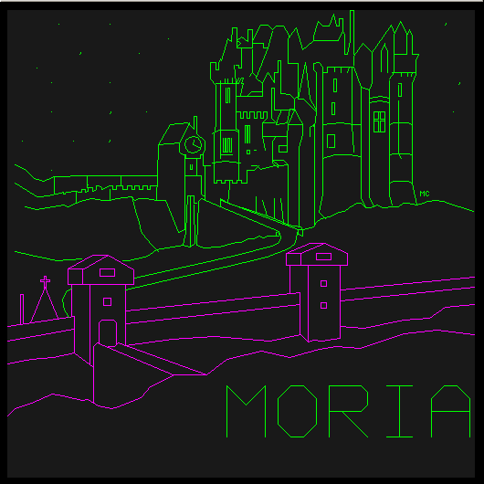
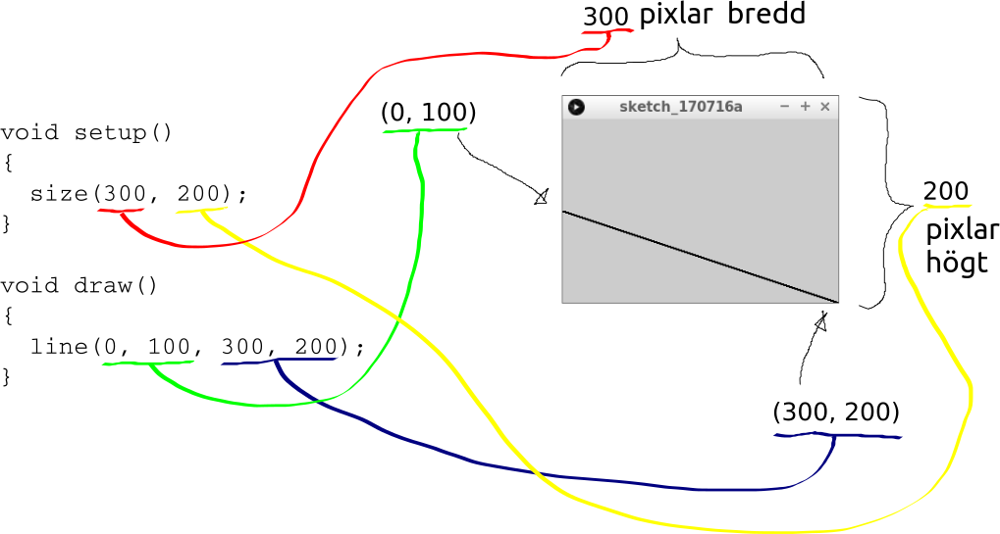
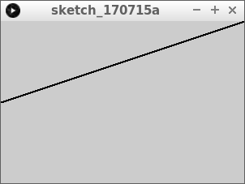
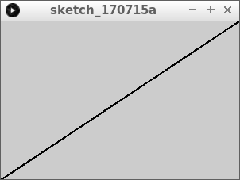
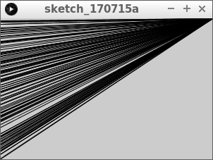
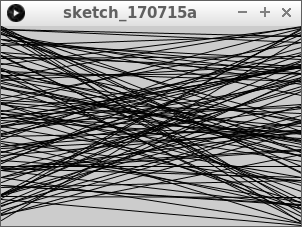
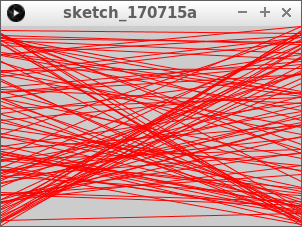
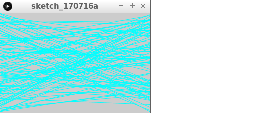
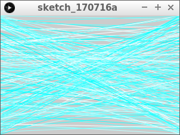

# Lektion 5: `line` och `stroke`



Under den här lektionen kommer vi att lära oss att rita färgade linjer.

\pagebreak

## 5.1. `line` och `stroke`: uppgift 1

Kör den här koden:

```processing
void setup()
{
  size(300, 200);
}

void draw()
{
  line(0, 100, 300, 200);
}
```

 | 
:-----:|:--------------------------------------------:
`line(0, 100, 300, 200);` | 'Kära dator, rita ut en linje från `(0, 100)` till `(300, 200)`.'

 | `(100, 200)` är pixeln som är `100` pixlar till höger om och `200` pixlar under fönstrets övre vänstra hörn
:-----------------:|:-----------------------------:

\pagebreak

### 5.1. Svar



\pagebreak

## 5.2. Uppgift 2



Ändra linjen så att den går till det övre högra hörnet,
istället för till den nedre högra hörnet.

\pagebreak

### 5.2. Svar

```processing
void setup()
{
  size(300, 200);
}

void draw()
{
  line(0, 100, 300, 0);
}
```

\pagebreak

## 5.4. Uppgift 3

Ändra linjen så att den börjar längst ner till vänster
istället för i mitten på vänster sida.



\pagebreak

### 5.4. Svar

```processing
void setup()
{
  size(300, 200);
}

void draw()
{
  line(0, 200, 300, 0);
}
```

\pagebreak

## 5.5. Uppgift 4

Låt linjen gå från nedre vänster till överst till höger,
men använd nu `width` och `height` istället.


\pagebreak

### 5.5. Svar

```processing
void setup()
{
  size(300, 200);
}

void draw()
{
  line(0, height, width, 0);
}
```

\pagebreak

## 5.6. Uppgift 5



Låt nu linjen starta i vänstra kanten på en slumpmässig höjd.
Du gör detta med `random`.

\pagebreak

### 5.6. Svar

```processing
void setup()
{
  size(300, 200);
}

void draw()
{
  line(0, random(height), width, 0);
}
```

\pagebreak

## 5.7. Uppgift 6



Låt linjen nu också sluta på en slumpmässig höjd i högra kanten.

\pagebreak

### 5.7. Svar

```processing
void setup()
{
  size(300, 200);
}

void draw()
{
  line(0, random(height), width, random(height));
}
```

\pagebreak

## 5.8. Uppgift 7



Precis ovanför meningen med `line`, skriv nu texten `stroke(255, 0, 0);`.

\pagebreak

### 5.8. Svar

```processing
void setup()
{
  size(300, 200);
}

void draw()
{
  stroke(255, 0, 0);
  line(0, random(height), width, random(height));
}
```

 | 
:-----:|:--------------------------------------------:
`stroke (255, 0, 0);` | 'Kära dator, färga linjerna röda.'
`stroke (255, 0, 0);` | 'Kära dator, färga linjerna helt röda, utan grönt och utan blått.'

\pagebreak

## 5.9. Uppgift 8



Gör linjerna cyan (ljusblå) nu. Titta på figuren 'Färgcirkel' hur du gör det


\pagebreak

## 5.9. Svar

```processing
void setup()
{
  size(300, 200);
}

void draw()
{
  stroke(0, 255, 255);
  line(0, random(height), width, random(height));
}
```

 | 
:-----:|:--------------------------------------------:
`stroke (0, 255, 255);` | 'Kära dator, färga linjerna cyan.'
`stroke (0, 255, 255);` | 'Kära dator, färga linjerna utan rött, helt gröna och helt blåa.'

\pagebreak

## 5.10. Uppgift 9



Sätt nu det röda värdet till ett slumpmässigt tal mellan 0 och 256.

\pagebreak

## 5.10. Svar

```processing
void setup()
{
  size(300, 200);
}

void draw()
{
  stroke(random(256), 255, 255);
  line(0, random(height), width, random(height));
}
```

\pagebreak

## 5.11. Slutuppgift


Låt nu linjer börja och sluta på slumpmässiga platser.
Linjefärgen måste också vara slumpmässig.

