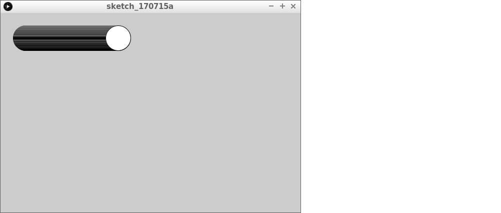
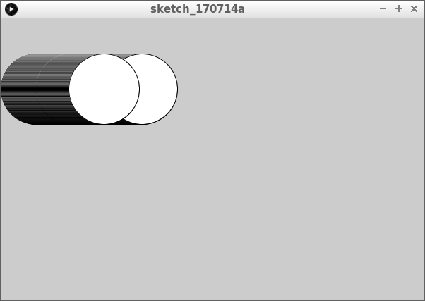
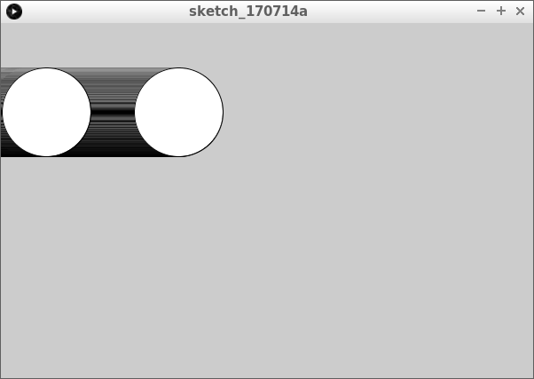
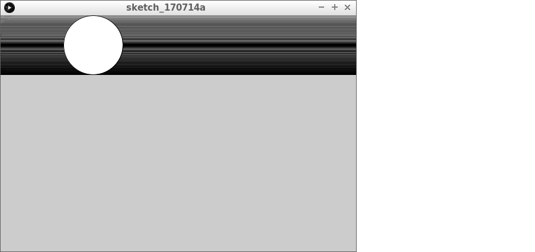
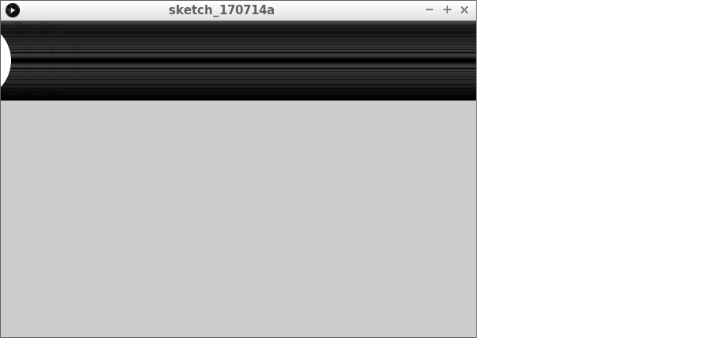
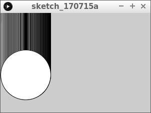
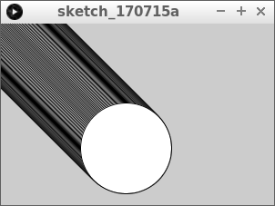
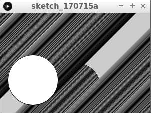

# Lektion 6: Låt bollen åka åt höger i all evighet

Under den här lektionen ska vi få en boll att åka åt höger i all evighet.

Under den här lektionen lär vi oss också vad en `if`-sats är.
Du kan (nästan) inte programmera utan `if`-satser.


\pagebreak

## 6.1. Intro



Detta är en boll som åker åt höger:

```processing
float x = 50;

void setup()
{
  size(600, 400);
}

void draw()
{
  ellipse(x, 50, 50, 50);
  x = x + 1;
}
```

Nackdel: bollen återvänder aldrig till fönstret.

\pagebreak

Vi vill kunna säga, "Kära dator, **om** bollen är för långt bort åt höger,
ska du teleportera bollen till vänster'. `if` är engelska för 'om'.

Så det här kan bli:

```processing
if (x > 200)
{
  x = 100;
}
```

Tecknet `>` betyder 'större än'.
Mer exakt blir det: "Kära dator, **om** `x` är större än `200`,
sätt `x` till `100`. `if` är engelska för 'om'.


 | 
:-----------------:|:-----------------------------:
`if(x > 200) {}` | 'Kära dator, om `x` är större än `200`, gör det som står inom måsvingarna.'
`x = 100;` | 'Kära dator, låt `x` vara `100`.'

\pagebreak

## 6.2. Uppgift 1



Skriv `if` inuti programmets kod.
Skriv `if` i slutet av `draw`, före den avslutande måsvingen (`}`).

\pagebreak

### 6.2. Svar

Koden blir då:

```processing
float x = 50;

void setup()
{
  size(600, 400);
}

void draw()
{
  ellipse(x,100,100,100);
  x = x + 1;
  if (x > 200)
  {
    x = 100;
  }
}
```

\pagebreak

## 6.3. Uppgift 2



Se till att bollen startar allra längst till vänster i fönstret

\pagebreak

### 6.3. Svar

- Ändra `float x = 50` till `float x = 0` eller `float x = -50`: båda är bra.
- Ändra `x = 100` till `x = 0` eller `x = -50`: båda är bra.

```processing
float x = 50;

void setup()
{
  size(600, 400);
}

void draw()
{
  ellipse(x,100,100,100);
  x = x + 1;
  if (x > 200)
  {
    x = 0;
  }
}
```

\pagebreak

## 6.4. Uppgift 3



Se till att bollen åker hela vägen till höger
innan den hoppar till vänster sida av fönstret

\pagebreak

### 6.4. Svar

Ändra `if (x > 200)` till `if (x > 650)`.

```processing
float x = -50;

void setup()
{
  size(600, 400);
}

void draw()
{
  ellipse(x,50,100,100);
  x = x + 1;
  if (x > 650)
  {
    x = 0;
  }
}
```

\pagebreak

## 6.5. Uppgift 4

Lurad!
Även om lektionen heter 'Låt bollen åka åt höger i all evighet',
så ska nu bollen byta håll.

Vi ska nu programmera en boll som åker åt vänster i all evighet.

Det du behöver titta på nu är `if`-uttalandet för att kunna avgöra när `x` är för litet:

```processing
if (x < 100)
{
  x = 500;
}
```

Med detta säger du: 'Kära dator, om `x` är mindre än (`<`) hundra,
sätt `x` till femhundra istället'.

 | 
:-----------------:|:-----------------------------:
`if (x < 100) {}` | 'Kära dator, om' x 'är mindre än 100, gör det som står innanför måsvingarna.'

\pagebreak



Gör en boll som åker åt vänster i all evighet:

- Bollen startar utanför fönstret
- Bollen åker helt utanför fönstret
- Om bollen åker utanför fönstret ska den omedelbart börja om igen på andra sidan

\pagebreak

### 6.5. Svar

Detta är en evighetsboll som åker åt vänster:

```processing
float x = 650;

void setup()
{
  size(600, 400);
}

void draw()
{
  ellipse(x, 50, 100, 100);
  x = x - 1;
  if (x < -50)
  {
    x = 650;
  }
}
```

 | 
:-----------------:|:-----------------------------:
`x = x - 1` | 'Kära dator, minska `x` med ett.'
`x -= 1` | 'Kära dator, minska `x` med ett.'
`x-` | 'Kära dator, minska `x` med ett.'
`--x` | 'Kära dator, minska `x` med ett.'

\pagebreak

## 6.6. Uppgift 5

Vi fick en boll att åka åt höger och åt vänster när vi ändrade koordinaten `x`.
Bollen kan också åka neråt och uppåt om vi ändrar y-koordinaten.



Skriv ett program där en boll åker neråt i all evighet:

- gör skärmen 300 pixlar bred och 200 pixlar hög
- använd en variabel som heter 'y'
- ersätt koden `ellips (x, 50, 100, 100)` med `ellipse (50, y, 100, 100)`
- om bollen åker neråt och utanför fönstret så måste bollen börja om uppifrån igen

\pagebreak

### 6.6. Svar

```processing
float y = -50;

void setup()
{
  size(300, 200);
}

void draw()
{
  ellipse(50,y,100,100);
  y = y + 1;
  if (y > 250)
  {
    y = -50;
  }
}
```

\pagebreak

## 6.7. Uppgift 6

Oj, nu när vi har skapat en variabel `x` och en variabel `y`, låt oss använda båda samtidigt!

När vi slår ihop kod gäller följande regler:

- allt som finns ovanför `setup` -funktionen ska vara kvar där
- allt som finns inuti `setup`-funktionen måste vara kvar inuti `setup`-funktionen
- allt som finns inuti funktionen `draw` måste vara kvar inuti funktionen `draw`



- Slå ihop koden för "Låt bollen åka åt höger i all evighet" med "Låt bollen åka neråt i all evighet"
- Ändra koden så att bollen också åker neråt

\pagebreak

### 6.7. Svar

```processing
float x = -50;
float y = -50;

void setup()
{
  size(300, 200);
}

void draw()
{
  ellipse(x,y,100,100);
  x = x + 1;
  y = y + 1;
  if (x > 350)
  {
    x = -50;
  }
  if (y > 250)
  {
    y = -50;
  }
}
```

\pagebreak

## 6.8. Slutuppgift



Låt nu bollen åka snett neråt vänster i all evighet.

