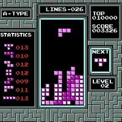
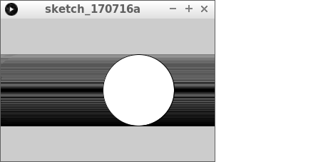
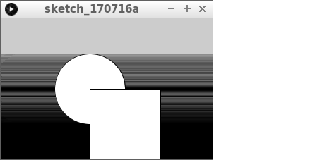
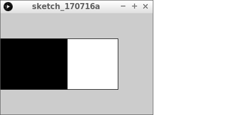
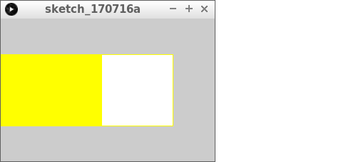
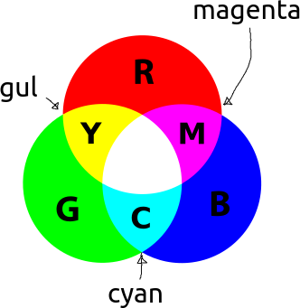
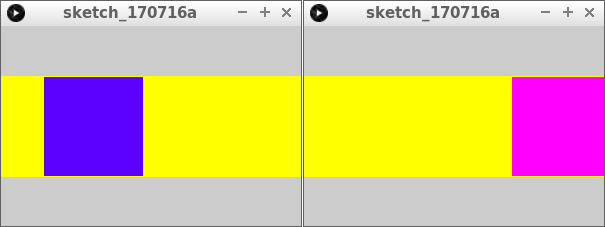
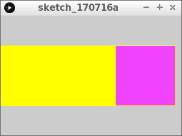
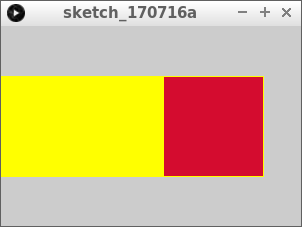

# Lektion 7: `rect` och `fill`

Här ser du ett av de mest berömda spel någonsin,
som är gjort med enkla fyrkanter som är ifyllda med olika färger:



Du kan göra en fyrkant med fyra linjer,
men `rect` är lättare.

\pagebreak

## 7.1. Uppgift 1

Kör denna kod.

```processing
float x = -50;

void setup()
{
  size(300, 200);
}

void draw()
{
  ellipse(x, height / 2, 100, 100);
  x = x + 1;
  if (x > width + 50)
  {
    x = -50;
  }
}
```

\pagebreak

### 7.1. Svar



\pagebreak

## 7.2. Uppgift 2

Lägg till följande text, efter `ellipse(x, height / 2, 100, 100);`:

```processing
  rect(x, height / 2, 100, 100);
```

 | 
:------------------------:|:---------------------------------------------------:
`rect (100, 200, 300, 400)` | 'Kära dator, rita ut en fyrkant med övre vänstra hörnet på `(100, 200)`, `300` pixlar bred och `400` pixlar hög.'

\pagebreak

### 7.2. Svar



```processing
float x = -50;

void setup()
{
  size(300, 200);
}

void draw()
{
  ellipse(x, height / 2, 100, 100);
  rect(x, height / 2, 100, 100);
  x = x + 1;
  if (x > width + 50)
  {
    x = -50;
  }
}
```

\pagebreak

## 7.3. Uppgift 3



Rita ut fyrkanten ovanpå bollen.
Gör det genom att minska `x` och `y`-koordinaterna med 50.

\pagebreak

### 7.3. Svar

```processing
float x = -50;

void setup()
{
  size(300, 200);
}

void draw()
{
  ellipse(x, height / 2, 100, 100);
  rect(x - 50, height / 2 - 50, 100, 100);
  x = x + 1;
  if (x > width + 50)
  {
    x = -50;
  }
}
```

\pagebreak

## 7.4. Uppgift 4



Ta nu bort den dolda bollen.
På denna plats, använd `stroke` igen, men nu med färgen gul.
Kolla på färgbollen nedanför:



\pagebreak

### 7.4. Svar

```processing
float x = -50;

void setup()
{
  size(300, 200);
}

void draw()
{
  stroke(255, 255, 0);
  rect(x - 50, height / 2 - 50, 100, 100);
  x = x + 1;
  if (x > width + 50)
  {
    x = -50;
  }
}
```

\pagebreak

## 7.5. Uppgift 5

Lägg till följande text under `stroke(255, 255, 0);`:

```processing
fill(x, 0, 255);
```

\pagebreak

### 7.5. Svar



```processing
float x = -50;

void setup()
{
  size(300, 200);
}

void draw()
{
  stroke(255, 255, 0);
  fill(x, 0, 255);
  rect(x - 50, height / 2 - 50, 100, 100);
  x = x + 1;
  if (x > width + 50)
  {
    x = -50;
  }
}
```

 | 
:----------------:|:----------------------------------------:
`fill(0, 128, 255);` | 'Kära dator, fyll i med en färg utan rött, som är halvt grön och helt blå.'

\pagebreak

## 7.6. Uppgift 6

Gör en ny variabel som heter `gron` (datorn gillar inte ord med `ö`).
`gron` ska ha startvärdet noll.
`gron` är det andra talet i `fill` (platsen efter `0`).
Varje gång ökar `gron` med två.

\pagebreak

### 7.6. Svar

```processing
float x = -50;
float gron = 0;

void setup()
{
  size(300, 200);
}

void draw()
{
  stroke(255, 255, 0);
  fill(x, gron, 255);
  rect(x - 50, height / 2 - 50, 100, 100);
  x = x + 1;
  gron = gron + 2;
  if (x > width + 50)
  {
    x = -50;
  }
}
```

\pagebreak

## 7.7. Uppgift 7



Variabeln `gron` kan inte bli högre än `255`. Gör en ny `if`-sats:
om `gron` är mer än `255`, ska `gron` bli `0`.

\pagebreak

### 7.7. Svar

```processing
float x = -50;
float gron = 0;

void setup()
{
  size(300, 200);
}

void draw()
{
  stroke(255, 255, 0);
  fill(x, gron, 255);
  rect(x - 50, height / 2 - 50, 100, 100);
  x = x + 1;
  gron = gron + 2;
  if (x > width + 50)
  {
    x = -50;
  }
  if (gron > 255)
  {
    gron = 0;
  }
}
```

\pagebreak

## 7.8. Uppgift 8



Den ifyllda färgen ska nu ha ett blåvärde
som är ett slumpmässigt tal mellan `0` och `256`.

\pagebreak

### 7.8. Svar

```processing
float x = -50;
float gron = 0;

void setup()
{
  size(300, 200);
}

void draw()
{
  stroke(255, 255, 0);
  fill(x, gron, random(256));
  rect(x - 50, height / 2 - 50, 100, 100);
  x = x + 1;
  gron = gron + 2;
  if (x > width + 50)
  {
    x = -50;
  }
  if (gron > 255)
  {
    gron = 0;
  }
}
```

\pagebreak

## 7.9. Slutuppgift


Nu ska du ändra både linjefärg och ifyllnadsfärg.
Linjefärgen ska vara röd, men det röda värdet ska vara slumpmässigt mellan `0` och `256`.
Ifyllnadsfärgen ska vara grön, och öka från `0` till `256` med `3` steg åt gången.
Om grönvärdet är större än `256`, måste den sättas till `0` igen.

