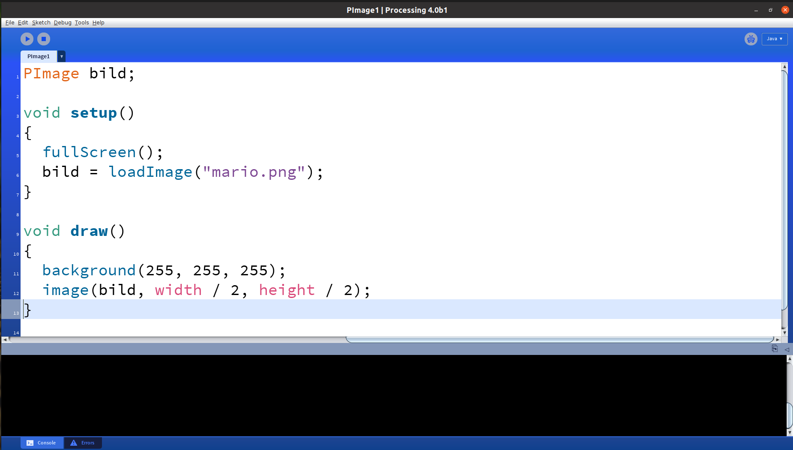
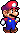
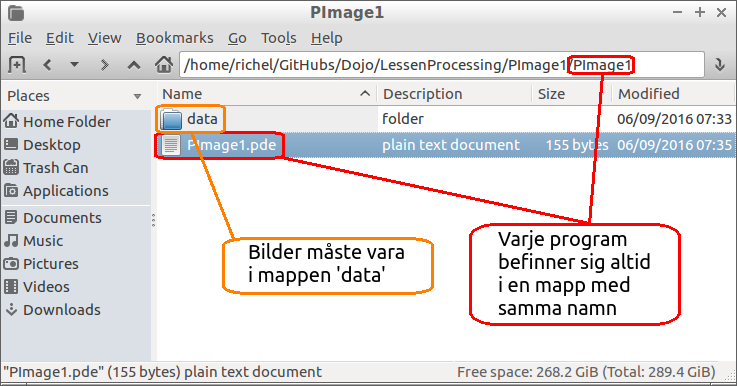

# 13. `PImage`

Under den här lektionen ska vi jobba med bilder!

 | 
:-----------------:|:-----------------------------:
`PImage`  | 'Pi-imugh'

\pagebreak

## 13.1. Felmeldningen

Spara den här koden. Kör koden. Vad ser du?

```processing
PImage bild;

void setup() 
{
  size(640, 360);
  bild = loadImage("mario.png");
}

void draw() 
{
  background(255, 255, 255);
  image(bild, 100, 200);
}
```

\pagebreak

### 13.1. Svar

Du får ett fel!



 | Datorn säger att den inte kan hitta bilden!
:-----------------:|:------------------------------:

\pagebreak

## 13.2. Att använda en bild

Gå till [https://raw.githubusercontent.com/richelbilderbeek/processing_foer_ungdomar/main/docs/chapters/13_PImage/mario.png](https://raw.githubusercontent.com/richelbilderbeek/processing_foer_ungdomar/main/docs/chapters/13_PImage/mario.png)
och ladda ner den här bilden av Mario.



Lägg den här bilden i en undermapp där din kod finns.

Här är en bild som visar var filerna ska vara:



- Skissen heter `PImage1.pde`. Därför finns den i mappen `PImage1`. 
  Du hittar detta i Bearbetning under `Sketch` -> `Show Sketch Map`
- Skissen har en mapp `data`. Den innehåller bilden `mario.png`.

\pagebreak

## 13.3. Slutuppgift


Gör så att programmet körs i helskärm. Gör bakgrunden grön och lägg bilden i mitten.
