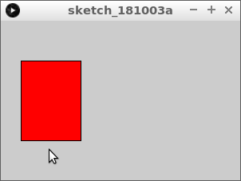
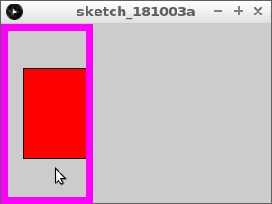
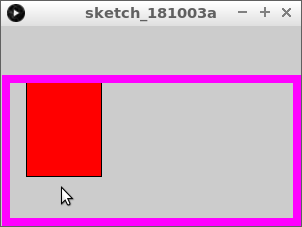

# 29. Muspekare i fyrkant

Under den här lektionen ska vi lära oss hur man ser
om muspekaren är inuti en fyrkant.

\pagebreak

## 29.1. Första `if` sats

Skriv denna kod över:

```processing
void setup()
{
  size(300, 200);
}

void draw()
{
  fill(255, 255, 255);
  if (mouseX > 25)
  {
    fill(255, 0, 0);  
  }
  rect(25, 50, 75, 100);  
}
```

Vad ser du? När blir fyrkanten röd?

\pagebreak

### 29.1. Svar

Fyrkanten blir röd när du flyttar muspekaren
mer än 25 pixlar åt höger.



\pagebreak

## 29.2. Andra `if` sats

Ändra koden så att fyrkanten blir röd när du flyttar musen
är till vänster om den högra sidan av torget.



 | 
:-----:|:--------------------------------------------:
`if (x < 200) { }`|'Bästa dator, om `x` är mindre än 200, gör vad som står mellan klammerparenteser.'

\pagebreak

### 29.2. Svar

```processing
void setup()
{
  size(300, 200);
}

void draw()
{
  fill(255, 255, 255);
  if (mouseX < 100)
  {
    fill(255, 0, 0);  
  }
  rect(25, 50, 75, 100);  
}
```

## 29.3. Att skriva 'och'

Vi kommer nu att kombinera `if`-satserna!

Ersätt `if`-satsen du har nu med detta:

```processing
  if (mouseX > 25 && mouseX < 100)
  {
    fill(255, 0, 0);  
  }
```

 | `&&` läses som 'och'
:-----:|:--------------------------------------------:

\pagebreak

### 29.3. Svar

```processing
void setup()
{
  size(300, 200);
}

void draw()
{
  fill(255, 255, 255);
  if (mouseX > 25 && mouseX < 100)
  {
    fill(255, 0, 0);  
  }
  rect(25, 50, 75, 100);  
}
```

## 29.4. `if` sats om höjden av muspekaren

Gör nu fyrkanten röd när muspekaren är under toppen av kvadraten.



\pagebreak

### 29.4. Svar

```processing
void setup()
{
  size(300, 200);
}

void draw()
{
  fill(255, 255, 255);
  if (mouseY > 50)
  {
    fill(255, 0, 0);  
  }
  rect(25, 50, 75, 100);  
}
```

## 29.5. Muspekare i fyrkant: slutuppgift

Gör rutan röd när muspekaren är i rutan.
