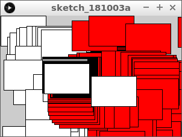
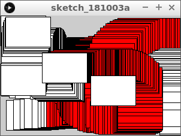
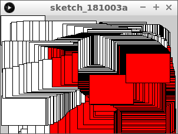
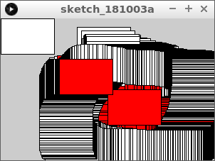

# 32. Fyrkanter krockar

Under den här lektionen ska vi lära oss hur man mäter om två fyrkanter krockar.

\pagebreak

## 32.1. En krock som inte funkar helt ännu

Skriv denna kod över:

```processing
float x1 = 150;
float y1 = 100;
float w1 = 75;
float h1 = 50;
float x2 = 75;
float y2 = 50;
float w2 = 75;
float h2 = 50;

void setup()
{
  size(300, 200);
}

void draw()
{
  x2 = mouseX;
  y2 = mouseY;
  fill(255, 255, 255);
  if (x2 + w2 > x1)
  {
    fill(255, 0, 0);  
  }
  rect(x1, y1, w1, h1);  
  rect(x2, y2, w2, h2);  
}
```

Vad ser du?

\pagebreak

### 32.1. Svar

Två rutor. En fyrkant följer musen.
Ibland när den rörliga fyrkanten vidrör den stationära blir den röd.



\pagebreak

## 32.2. En lite bättre krock

Ändra `if` satsen till:

```processing
if (x2 + w2 > x1 && x2 + w2 < x1 + w1)
```

Vad ser du?

\pagebreak

### 32.2. Svar

Rutorna krockar nu horisontellt.



```processing
// ...

void setup()
{
  size(300, 200);
}

void draw()
{
  // ...
  if (x2 + w2 > x1 && x2 < x1 + w1)
  {
    fill(255, 0, 0);  
  }
  rect(x1, y1, w1, h1);  
  rect(x2, y2, w2, h2);  
}
```

\pagebreak

## 32.3. En bättre krock

Ändra nuvarande `if` satsen till:

```processing
if (x2 + w2 > x1 && x2 < x1 + w1 && y2 + h2 > y1)
```

Vad ser du?

\pagebreak

### 32.3. Svar

Rutorna krockar just nu förutom på toppen.



## 32.4. Slutuppgift

Gör `if` satsen ännu längre så att rutorna krockar.


