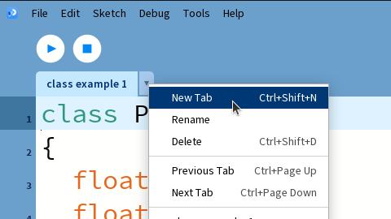
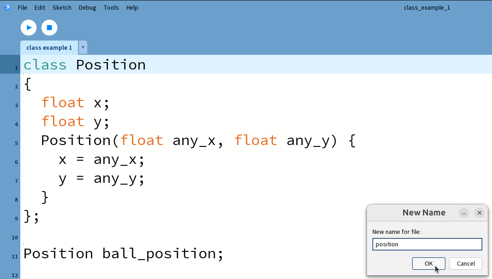

# 42. Klasser 1

Klasser är ett sätt att bunta data.
Under den här lektion skapar vi en sådant klass.


## 42.1. Att använder en `Position` klass

Sedan du har programmerat en bol som studsar snett, har du skrivit följande:

```processing
float x = 160;
float y = 100;

void setup()
{
  size(320, 200);
}
void draw() 
{
  ellipse(x, y, 10, 10);
}
```

Du har skapat två variabler, även om den här två variabler hör ihop:
tillsammans är dem **positionen** av bollen.

Så kan vi uttrycka att en position har ett x och ett y koordinat:

```processing
class Position
{
  float x;
  float y;
};
```

Ett klassnamn startar med ett stort bokstav (i den här fall en `P`).
Klassen `Position` (läs den här på engelska, så 'på-sis-jön')
har två **medlemsvariabler** kallad `x` ('ex') och `y` ('vaj').
En klass alltid slutar med en semikolon (`;`).

Man läser den här kod som: 'En `Position` **har** ett `x` och ett `y`'.
Nyckelordet är 'har': en mening så här måste vara rimligt svenska/engelska.
Till exempel, meningen 'en `Position` har en hastighet' är nonsens.
Istället kan man säga 'en `Player` har en `Position` och en hastighet'.

Nu kan vi skapar en variable som heter `ball_position` så här:

```processing
Position ball_position; 
```

Igen, namnet av en klass börjar med ett stort bokstav, namn av ett
variabel med ett lite bokstav.

Inte glöm att initialisera detta i `setup` funktionen, så här:

```processing
ball_position = new Position();
```

För att skriva x-värdet av positionen, gör man:

```processing
ball_position.x = 160;
```

Den period (`.`) läser man som 'av', i den här fall:
'(över)skriv `x`-värdet av `ball_position` med `160`'

Att läsa x-värdet av position går identiskt:

```processing
ellipse(ball_position.x, 100, 10, 10);
```

Får den hela koden att funkar med en `Position` klass.

### 42.1. Svar

```processing
class Position
{
  float x;
  float y;
};

Position ball_position; 

void setup()
{
  size(320, 200);
  ball_position = new Position();
  ball_position.x = 160;
  ball_position.y = 100;

}
void draw() 
{
  ellipse(ball_position.x, ball_position.y, 10, 10);
}
```

## 42.2. En kontructor som saknas

I koden finns något som är lite mycket skrivning:

```processing
ball_position = new Position();
ball_position.x = 160;
ball_position.y = 100;
```

Ändra den här koden till:

```processing
ball_position = new Position(160, 100);
```

Vilket felmeldning får du?

### 42.2. Svar

Du får felmeldningen likadant:

```processing
The constructor sketch_260806a.Position(int, int) is undefined
```

Processing frågar oss snäll (som vanligt) att skriva en konstruktor.

## 42.3. Att skriva en konstruktor

Ändra koden av `Position` till den här:

```processing
class Position
{
  float x;
  float y;
  Position(float any_x, float any_y) {
    x = any_x;
    y = any_y;
  } 
};
```

Vi har just skapat en så-kallade 'constructor'. Detta är ett engelskt
ord för svenskt 'konstruktor', som betyder 'detta som skapar'.
Man säger 'med den konstruktor av `Position` kan du skapa en `Position`'

Den här konstruktor har två **argument**: `any_x` och `any_y`.
Man kann inte kalla dem `x` och `y`, för att i nästa två rader blir
Processing förvirrad (`x = x;` är väl lite konsigt).
I en konstruktor läser man `x = any_x;` som: 'sätt **medlemsvariabeln** `x`
till värdet av `any_x`.

Lägg till konstruktorn i din kod.

### 42.3. Svar

```processing
class Position
{
  float x;
  float y;
  Position(float any_x, float any_y) {
    x = any_x;
    y = any_y;
  } 
};

Position ball_position; 

void setup()
{
  size(320, 200);
  ball_position = new Position(160, 100);

}
void draw() 
{
  ellipse(ball_position.x, ball_position.y, 10, 10);
}
```

## 42.4. En egen fil för en klass

Det är vanligt att en klass har sin egen fil.

Klicka på 'New tab'.



Ger ett namn för din nya fil, i den här fall `position` (med lite
bokstav).



Du har nu skapad en fil kallad `position.pde`.

Du kann ser att `position.pde` är kallad sådant i en filutforskare:


Processing visar att `position.pde` är ännu tomt.


Flytta koden av klassen `Position` hit.


Nu kan du köra koden som vanligt.

Flytta koden av klassen `Position` till sin egen fil.

### 42.4. Svar

Koden blir, i `position.pde`:

```processing
class Position
{
  float x;
  float y;
  Position(float any_x, float any_y) {
    x = any_x;
    y = any_y;
  } 
};
```

I den huvud tab stannar kvar den här kod:

```processing
Position ball_position; 

void setup()
{
  size(320, 200);
  ball_position = new Position(160, 100);

}
void draw() 
{
  ellipse(ball_position.x, ball_position.y, 10, 10);
}
```

## 42.99 Slutuppgift

Här har vi koden av en boll som studsar horisontellt:


```processing
float x = 300;
float hastighet = 2;

void setup()
{
  size(600, 100);
}

void draw()
{
  ellipse(x, 50, 100, 100);
  x = x + hastighet;
  if (x > 550)
  {
    hastighet = -hastighet;
  }
  if (x < 50)
  {
    hastighet = -hastighet;
  }
}
```

Använder en klass för positionen kallad `Position`. En position
har en x-koordinat kallad `x`'. Klassen är i en fil kallad `position.pde`.

Använder en klass för hastigheten kallad `Velocity`. En hastighet
har en ändring i x-riktningen kallad `dx`, läsas som (svenska) 'di-ex',
eller (engelska) 'delta `x`'. Klassen är i en fil kallad `velocity.pde`.

Får koden att funkar med dina klass.
