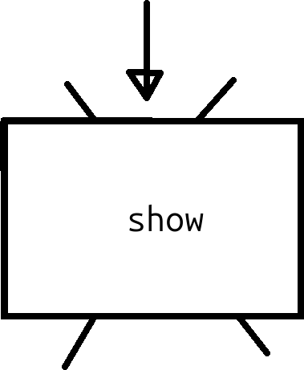
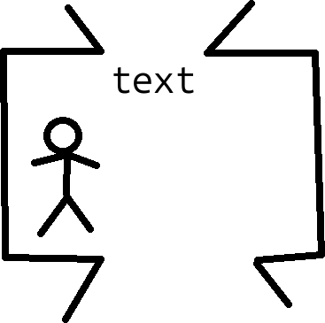

# 34. Funktioner 2

Funktioner hjälper en programmerare att uttrycka sina tankar bättre:
istället av göra samma sak med felmeldningen överallt, kan man göra
det med en funktion.

## 34.1. En `String`

En `String` är en datatype för text, dvz ingen, ett, eller fler karaktär.

Kolla på och kör följande kod. Kan du förstå vad allt betyder?

```processing
void setup() 
{
  final String a = "Hello";
  final String b = "World";
  final String space = " ";
  println(a + space + b);
}

void draw() { }
```

### 34.1. Svar

Här ser vi några saker:

- `draw` är en funktion som gör inget. Dät är fint: vi vill bara göra något
  en gång.
- Nyckelordet `final` dyker upp. `final` betyder att värdet av variabeln kan
  inte andras efter variablen fick den värde. Om du kan använda `final`,
  så göt detta!
- Vi använder tre `String`. Värdet av en `String` är mellan dubbla
  citattecken (`"`).
- Vi använda ett plus tecken (`+`) att koppla ihop fler `String`s,
  så att dem blir ett ord
- Vi använder en funktion som heter `println`, som skriver i konsoln
  ('Console', längst nere) av Processing


## 34.2. Att visa fel

Här skapar vi en funktion själv, som visar text:

```processing
void show(final String text)
{
  println(text);
}
```

Här ser vi några saker:

- Funktionen heter `show`
- Mellan rundparenteser (`(` och `)`) finns **argumenter**
  som går inne i funktionen. I den här fall är det ett argument,
  av datatyp `String`. På grund av `final` kan värdet inte blir ändrat.
- Mellan måsvingar (`{` och `}`) finns **funktionskroppen**
  och där blir inmatningen `text` använt: den blir skickad till `println`.

Det är hjälpsams att ser en funktion som den här tva cartoonerna här
nere. Först, en funktion utifrån är likadant en låda med ett
namn (i den här fall `show`), ett ingångshål från ovan sida, och
ett utgångshål på nere sida:



Inne i funktion lever en lille gubbe som gör saker.
Gubben har ett namn för saker som kommer in i ingångshålet,
`text` i den här fall.
Gubben vet var utgångshålen är, men i den här fall blir den inte användt.



Detta är hela gubbens värld. Tekniskts heter detta att
funktionsargumenter har ett lokalt omfång (engelska: 'local scope'):
dem bara är kända som detta inom funktionen.

Skapa ett nutt funktion som heter `show_error`.
Om du ger funktion en `String`, visar den `ERROR:` och
värdet av `String`en. Test funktion med att använda den i din kod.

### 34.2. Svar

Här är ett möjligt svar:

```processing
void show_error(final String e)
{
  println("ERROR: " + e);
}

void setup() 
{
  show_error("You should never start this program");
}

void draw() { }
```

Här, `show_error` kallar `String`en `e`. Du får kallar den hur som helst.
Man kan säga att `e` är för kort, och man föredra `error_message` istället.
Också `text` eller `s` ('en `String`')
funkar bra som namn av funktionsargumentet.

## 34.3. `exit`

Vär funktion är inte helt nyttigt för felsökningen: den bör stänga av
programmet när något fel händer.

Lägg till den här rad inom funktionskroppen av `show_error`:

```processing
exit();
```

Vad tror du att `exit` gör? Vad händer?

### 34.4. Svar

`show_error` blir:

```processing
void show_error(final String e)
{
  println("ERROR: " + e);
  exit();
}
```

Du kan ser att `exit` stänger av programmet.
I vår fall säger programmet en felmeldning och stänger av programmet.
Det ska hjälper oss med felsökning!

## 34.5. Felsökning

Här har vi ett bekant program, nu med felsökning:

```processing
float x = 50;

void show_error(final String e)
{
  println("ERROR: " + e);
  exit();
}

void setup()
{
  size(320, 200);
}

void draw()
{
  ellipse(x, 100, 100, 100);
  x = x + 1;
  if (x > width + 50)
  {
    x = -50;
  }
  if (x > width + 50) show_error("x is too big");
  if (x < -50) show_error("x is too small");
}
```

Den här stil är kallad 'att programmera defensivt': du, som programmerare,
vet att du är felaktig, och du hjälper dig själva med dina fel.

## 34.5. Slutuppgift

Tar en spel av dig själva och lägg till funktionen `show_error`
och användt den på ett nyttigt sät åtminstone fem gånger.

