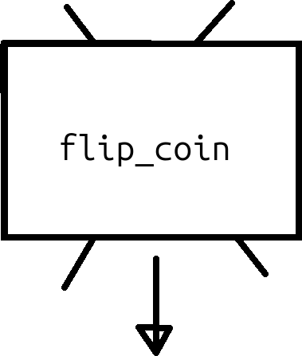
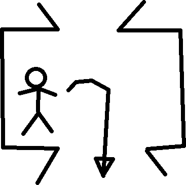

# 35. Funktioner 3

Funktioner hjälper en programmerare att uttrycka sina tankar bättre:
istället av att göra samma beräkning hela tiden, kan du göra detta
på ett ställe.

## 35.1. En simulation

Vi vill skriva den följande kod:

```processing
int n_heads = 0;
int n_tails = 0;

void setup() {}

void draw()
{
  if (flip_coin() == CoinSide.HEADS)
  {
    ++n_heads;
  }
  else
  {
    ++n_tails;
  }
  println("n_heads: ", n_heads, "n_tails: ", n_tails);
}
```

Vad trot att den gör? Kan du redan ser vad blir felmeldningen?

### 35.1. Svar

Det är en slantsingling-simulator!

- `n_heads` och `n_tails` räknar hur ofta det var krona
  eller klave. Datatyp av båda är en `int`: ett heltal.
  Det stämmer, för att vi kan säga 'vi fick krona två gånger',
  och det är konstigt att säga 'vi fick klave ett-och-halv gånger'.
- `setup` funktion är tomt. Det är okej: vi behöver ej att rita saker
- `flip_coin` är ett funktion som gör slantsinglingen
- `CoinSide.HEADS` är ett värde av en uppräkning för sidorna av en mynt.
- `++n_heads` är en förkortning av `n_heads = n_heads + 1`.
  Vi läser `++n_heads` på svenska som 'öka `n_heads` med en',
  eller bara 'öka `n_heads`'.
- `println` visar sig att kunna göra fler argument! Det är fint:
  vi bara ger `println` fyra argument här av två olika datatype
  och 'den bara funkar'. `println` är kanon!

## 35.2. En funktion med en returnvärde

Här har vi koden som saknas:

```processing
enum CoinSide { HEADS, TAILS };

CoinSide flip_coin()
{
  if (random(2) < 1.0)
  {
    return CoinSide.HEADS;
  }
  return CoinSide.TAILS;
}
```

Raden `CoinSide flip_coin()` läser man som '`flip_coin` är ett funktion
som behöver inga ingångsvärder (pga `()`)
och ger returvärde av datatyp `CoinSide`'.

Rad `if (random(2) < 1.0)` läsas som 'om en slumpmässigt valt
bråktal mellan noll och två är mindre än ett, ...'.
I hälften av fall blir detta sant och ger funktionen en returvärd av krona.
Om inte (också i hälften av fall),
ger funktionen en returvärd av klave.

Får koden att funkar. Stämmer den?

### 35.2. Svar

Ja, koden stämmer, även om sifforna är inte alltid exact samma.
Det är på grund av slump.
Man kan använda **statistik** för att beräkna om att mängerna
är slump eller inte.
I våran fall antar vi att datorn är ärligt.

Nu vi har skapat en funktion med en returvärde, kan vi kolla
hur det ser ut i en cartoon utifrån:



Utifrån är vår funktion bara en låda som producerar returvärder.

Här mår gubben inne i funktionen:



Gubben inte kollar uppåt längre: det finns inga ingångsargument här.
Gubben bara kasta ur saker till utgångshålen nere.

## 35.3. Varför koden är så långsamt

Kör koden och räknas hör snabbt den går.
Hur mycket mynt blir uppkastade verja sekund?
Hur mycket beräkningar kann en dator göra?
Vad gissar du att orsaka skillnaden?

### 35.3. Svar

Du får några tusen mynta uppkastade varje minut.
En dator kan göra milliarder beräkningar varje minut.
Skillnaden är inte beräkningen:
skillnaden är orsakad av `println`: att skriva ut värd är långsamt.

## 35.4. Att göra koden snabbare

För att göra koden snabbare, ska vi skapar en nytt funktion, kallad
`simulate_coin_flips`. Den har en ingångsargument kallad `n_coin_flips`,
som bestämmer hör mycket mynt blir kastade. Funktionen har en `int`
som returnvärde som innehåller hur ofta krona blev kastad.

Skriv koden av `flip_n_coins`. Kanske du bor kolla upp igen
hur man använder en `for` slinga.

### 35.4. Svar

Här är en möjlighet:

```processing
int flip_n_coins(final int n_coin_flips)
{
  int n_heads = 0;
  for (int i = 0; i != n_coin_flips; ++i)
  {
    if (flip_coin() == CoinSide.HEADS)
    {
      ++n_heads;
    }
  }
  return n_heads;
}
```

- `int flip_n_coins(final int n_coin_flips)` läser man som:
  '`flip_n_coins` är en funktion som behöver ingångsargumentet
  `n_coin_flips` och har en `int` som returvärde, varav
  `n_coin_flips` är en heltal som kan inte blir ändrat i funktionen'.
- `int n_heads = 0` är för att skapa en **lokal** variabel som heter
  `n_heads`, är en heltal och har startvärde noll.
- Den `for (int i = 0; i != n_coin_flips; ++i)` är den mest
  standard `for` slinga som finns. Dem läsas som: 'Räknar upp `i` från noll
  till (och exclusive) `n_coin_flips`'. Den `!=` betyer 'är olika'.

## 35.5. Slutuppgift

Nu ska vi göra färdigt vår simulation av en slantsingling:

- Använder `flip_n_coins` bara en gång men kastar en miljon mynt
- Visar hur ofta programmat fick krona och klave med `println` bara en gång


## 35.6. Bonus

Om du vill ser om myntet är ärligt, här är statistik koden:

```processing
boolean is_coin_fair(final int n_heads, final int n_tails) {
  final int n = n_heads + n_tails;
  final float p_hat = n_heads / (float) n;
  final float se = sqrt(0.25 / n);
  final float z = (p_hat - 0.5) / se;
  
  // Two-tailed p-value using normal approximation
  final float p_value = 2
    * (1 - get_chance_to_find_z_or_less(abs(z)));
  final float alpha_value = 0.05; // Social convention
  return p_value > alpha_value;
}

float get_chance_to_find_z_or_less(float z) {
  return 0.5 * (1 + calculate_error(z / sqrt(2)));
}

float calculate_error(float normalized_z) {
  final float a1 =  0.254829592;
  final float a2 = -0.284496736;
  final float a3 =  1.421413741;
  final float a4 = -1.453152027;
  final float a5 =  1.061405429;
  final float p  =  0.3275911;
  final int sign = (normalized_z < 0) ? -1 : 1;
  final float x = abs(normalized_z);
  final float t = 1.0 / (1.0 + p * x);
  final float y = 1.0 - (((((a5 * t + a4) * t) + a3)
    * t + a2) * t + a1) * t * exp(-x * x);
  return sign * y;
}
```

Gjärna copy-paste detta :-)

