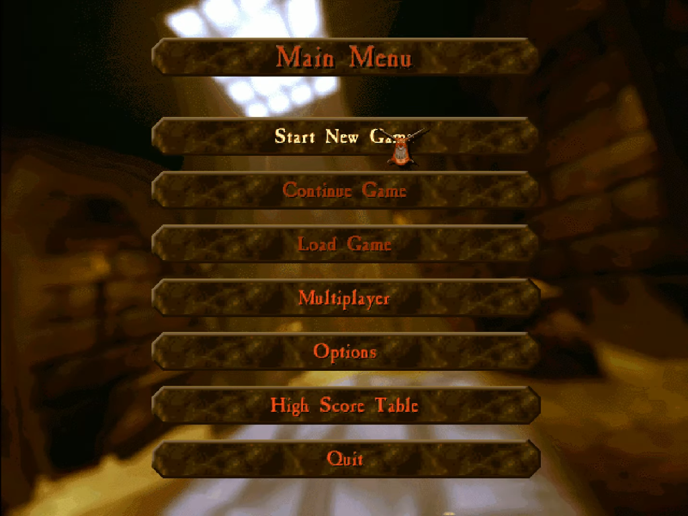

# 46. Meny

Dem flesta spel har en meny.

<!-- https://sega-brasil.com.br/Tectoy/Arquivo:PCImagemDungeonKeeper_02.png -->

## 46.1. Del av en meny

Målet av en meny är at ger spelaren sin första intryck av ditt spel.
Därför bör den har titeln av ditt spel.
Också nästan alltid finns det denna ord 'Start' och 'Quit',
för att starta eller
stänga av dit spel.

Ibland finns det en mölighet för speloptioner ('Options')
eller erkännanden ('Credits' eller 'Acknowledgments'/'Acknowledgements').

## 46.2. Slutuppgift

I en spel som du redan har, skapa en meny med:

- Titeln av spelet
- Har en möjlighet att starta spela
- Har en möjlighet att stänga av spelet

Spelet måste göra något, men behövs inte vara komplett.
