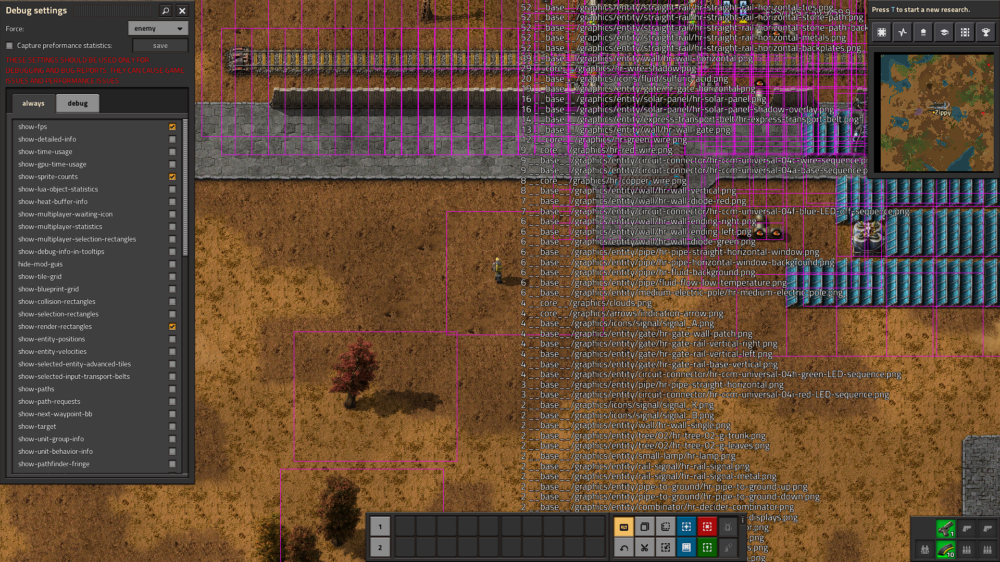

# 47. Debug mode

Ibland har spel en så-kalla 'Debug mode'.

<!-- From https://wiki.factorio.com/File:Debug_during_play.png -->

## 47.1. Målet av en debug mode

Målet av en debug mode är felsökning:
en envändare kan ser mer saker än vanligt.
Ofta finns det ett sätt att start den där moden,
t.ex. att trycka på F3 i Minecraft.

## 47.2. Slutuppgift

I en spel som du redan har, skapa en debug mode som visar
något under spelet som spelaren inte kann ser lätt,
t.ex. mängd av fiender, hälsa av en fiende, unv.
