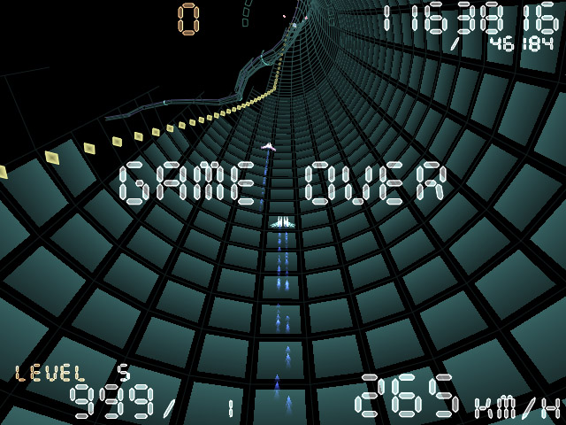
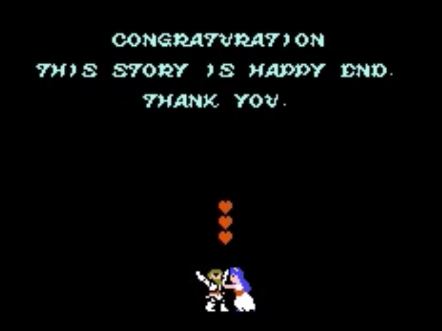

# 48. 'Game Over' och 'Game Won'

Ibland har spel en så-kalla 'Game Over' och 'Game Won' skärm.

<!-- From https://en.wikipedia.org/wiki/Game_over#/media/File:Torus_Trooper_-_Game_Over.jpg -->

<!-- From https://www.unseen64.net/tag/unseen64/page/5/ -->

## 48.1. Målet av en 'Game Over' skärm

Målet av en 'Game Over' skärm
är att visa speleren att den har förlorat spelet.
Ibland finns det möjligheter att
starta om, att återuppta ditt liv (engelska: 'respawn'),
fortsätta (engelska 'Continue') eller ladda en sparfil ('Load saved game').

## 48.2. Målet av en 'Game Won' skärm

Målet av en 'Game Won' skärm
är att visa speleren att den har vunnit spelet.
Ibländ finns det vackra animationer som visar hur en berättelse
slutar efter den sista bossfighten. Ofta är en spelslut glad.

I det förflutna var en 'Game Won' skärm bara den ord 'Congratulations'.
Det var inte så tillfredsställande.

## 48.3. Slutuppgift

I en spel som du redan har, skapa en 'Game Over'
och en 'Game Won' skärm.
Det måsta vara möjligt att visar båda skärmar lätt.
Du får ändra kod när du vill visa en av den skärmar.
