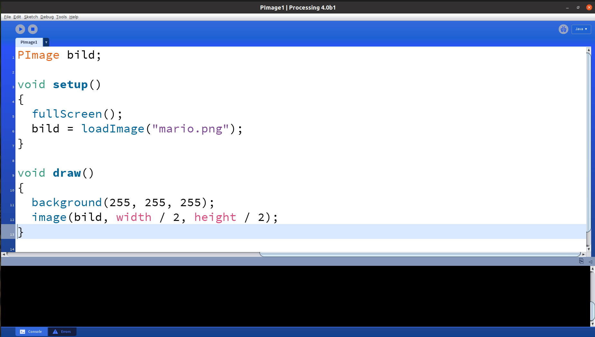

# `PImage`

I den här lektionen ska vi jobba med bilder!


\pagebreak

## `PImage`: kommando 1

Spara den här koden. Kör den här koden. Vad ser du?
   
```c++
PImage plaatje;

void setup() 
{
  size(640, 360);
  plaatje = loadImage("mario.png");
}

void draw() 
{
  background(255, 255, 255);
  image(plaatje, 100, 200);
}
```

\pagebreak

## `PImage`: lösning 1

Du får ett fel!



 | Datorn säger att den inte kan hitta bilden!
:-----------------:|:---------------------- ------- :

\pagebreak

## `PImage`: kommando 2

Gå till [https://github.com/richebilderbeek/Dojo/blob/master/LessenProcessing/PImage/mario.png](https://github.com/richebilderbeek/Dojo/blob/master/LessenProcessing/PImage/mario. png)
och ladda ner den här bilden av Mario.


Lägg den här bilden i en undermapp där din kod finns.

Här är en bild som visar var filerna ska vara:


 * Skissen heter `PImage1.pde`. Därför finns den i mappen `PImage1`. Du hittar detta i Bearbetning under `Sketch` -> `Show Sketch Map`
 * Skissen har en mapp `data`. Den innehåller bilden "mario.png".

\pagebreak

## `PImage`: sista kommandot


Gör programmet i helskärm, gör bakgrunden grön och lägg bilden i mitten.
