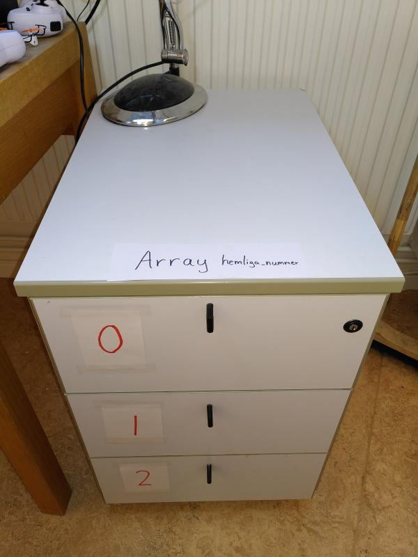
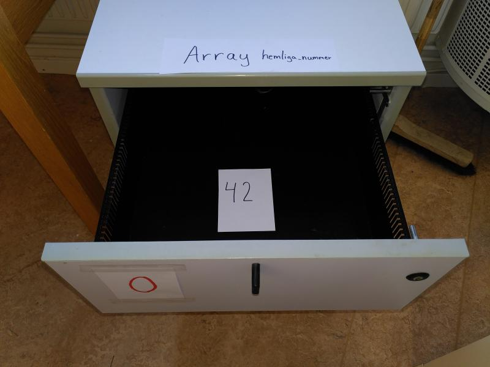

# Arrayer 1

Med arrayer kan du få datorn att komma ihåg många värden:
koordinaterna för kulor, meteoriter, fiender.


\pagebreak

## Arrayer 1: Uppgift 1

Kör den här koden. Vad gör den?

```processing
float x = 0;

void setup()
{
  size(600, 50);
}

void draw()
{
  ellipse(x,25,50,50);
  x = x + 1;
  if (x > 625)
  {
    x = -25;
  }
}
```

\pagebreak

## Arrayer 1: lösning 1

En boll som åker åt höger i all evighet!


\pagebreak

## Arrayer 1: Uppgift 2

Se till att lägga till en andra boll.


 | Tips: ändra namnet `x` till `x1`.
:-----------------:|:-----------------------------:

 | Skapa sedan en ny variabel som heter `x2`.
:-----------------:|:-----------------------------:

\pagebreak

## Arrayer 1: lösning 2

```processing
float x1 = 0;
float x2 = 100;

void setup()
{
  size(600, 50);
}

void draw()
{
  ellipse(x1,25,50,50);
  ellipse(x2,25,50,50);
  x1 = x1 + 1;
  x2 = x2 + 1;
  if (x1 > 625)
  {
    x1 = -25;
  }
  if (x2 > 625)
  {
    x2 = -25;
  }
}
```

 | Detta var sju rader extraarbete
:-----------------:|:-----------------------------:

\pagebreak

## Arrayer 1: Uppgift 3

Lägg till en tredje boll.


\pagebreak

## Arrayer 1: lösning 3

```processing
float x1 = 0;
float x2 = 100;
float x3 = 200;

void setup()
{
  size(600, 50);
}

void draw()
{
  ellipse(x1,25,50,50);
  ellipse(x2,25,50,50);
  ellipse(x3,25,50,50);
  x1 = x1 + 1;
  x2 = x2 + 1;
  x3 = x3 + 1;
  if (x1 > 625)
  {
    x1 = -25;
  }
  if (x2 > 625)
  {
    x2 = -25;
  }
  if (x3 > 625)
  {
    x3 = -25;
  }
}
```

 | Detta var ytterligare sju rader extraarbete
:-----------------:|:-----------------------------:

 | Det här kan göras smartare, med arrayer!
:-----------------:|:-----------------------------:

\pagebreak

## Arrayer 1: vad är en array?

En array är som ett skåp med lådor.


Varje låda har ett nummer utanpå och varje låda kan innehålla ett nummer inuti.



 | Den första platsen (lådan) i en array har alltid numret `0`
:-----------------:|:-----------------------------:

Här ser du lådans nummer och det nummer som finns inuti den:
Låda nummer `0` har nummer `42` inuti sig.



 | 
:-----------------:|:-----------------------------:
`Arrayen börjar med index 0`|'Den första platsen i arrayen har numret 0'

\pagebreak

## Arrayer 1: arbeta med en array

Anta att vi vill skapa en array av bråktal (`float`s) som kallas `hemliga_nummer`,
då måste vi skriva följande ovanför `setup`:

```processing
float[] hemliga_nummer;
```

Med denna rad skapar du en array som heter `hemliga_nummer`. Hakparentesen bakom `float` betyder att det är en array.

 | 
:-----------------:|:-----------------------------:
`float[] hemliga_nummer`|'Kära dator, kom ihåg många bråktal i en array som kallas `hemliga_nummer`'


Det har ännu inte bestämts *hur många* bråktal det är.
Ofta används "setup"-funktionen för att bestämma hur många nummer som ska kommas ihåg:
processing
```
hemliga_nummer = new float[1];
```

Det här betyder att arrayen `hemliga_nummer` innehåller 1 plats.


 | 
:-----------------:|:-----------------------------:
`hemliga_nummer = new float[1]`|'Kära dator, låt `hemliga_nummer` innehålla 1 låda`'


\pagebreak

För att att göra en exakt kopia av skåpet med lådorna kan du använda följande kod:

```processing
hemliga_nummer[0] = 42;
```

Detta sparar siffran 42 på första plats i arrayen, dvs platsen med numret 0.

 | 
:-----------------:|:-----------------------------:
`hemliga_nummer[0] = 42`|'Kära dator, spara siffran `42` på första platsen i arrayen `hemliga_nummer`'

Du kan också läsa värdet i lådorna:

```processing
float x = hemliga_nummer[0];
```

Med detta läser du den första platsen (lådan med index noll) och sparar den i variabeln `x`.

 | 
:-----------------:|:-----------------------------:
`float x = hemliga_nummer[0]`|'Kära dator, se vad som finns i lådan med index noll och kom ihåg det som `x`'

Tillsammans får du detta program:

```processing
float[] hemliga_nummer;

void setup()
{
  size(400, 400);
  hemliga_nummer = new float[1];
  hemliga_nummer[0] = 42;
}

void draw() 
{
  float x = hemliga_nummer[0];
  ellipse(x, 200, 300, 400);
}
```
Den här programmeringskoden ser inte särskilt trevlig ut med alla hakparenteser. Den är tänkt att visa dig hur du skapar, fyller i och läser arrayer.

\pagebreak

## Arrayer 1: Uppgift 4

Kör koden nedan.

```processing
float[] xs;

void setup()
{
  size(600, 50);
  xs = new float[3];
  xs[0] = 0;
  xs[1] = 100;
  xs[2] = 200;
}

void draw()
{
  ellipse(xs[0],25,50,50);
  ellipse(xs[1],25,50,50);
  ellipse(xs[2],25,50,50);
  xs[0] = xs[0] + 1;
  xs[1] = xs[1] + 1;
  xs[2] = xs[2] + 1;
  if (xs[0] > 625)
  {
    xs[0] = -25;
  }
  if (xs[1] > 625)
  {
    xs[1] = -25;
  }
  if (xs[2] > 625)
  {
    xs[2] = -25;
  }
}
```

\pagebreak

## Arrayer 1: lösning 4

Hej, samma som förut!


\pagebreak

## Arrayer 1: Uppgift 5

Kör den här koden:

```processing
float[] xs;

void setup()
{
  size(600, 50);
  xs = new float[3];
  for (int i=0; i<3; ++i)
  {
    xs[i] = i * 100;
  }
}

void draw()
{
  for (int i=0; i<3; ++i)
  {
    ellipse(xs[i],25,50,50);
    xs[i] = xs[i] + 1;
    if (xs[i] > 625)
    {
      xs[i] = -25;
    }
  }
}
```

 | Bra programmerare använder hellre `for`-loopar än att kopiera och klistra in många gånger i onödan
:-----------------:|:-----------------------------:

\pagebreak

## Arrayer 1: lösning 5

Hej, samma som förut!

 | 
:-----------------:|:-----------------------------:
`for (int i=0; i<3; ++i) {}`|'Kära dator, gör vad som står mellan måsvingarna med värden på `i` från `0` till mindre än `3` i steg om `1`'

 | Jag är en dum dator
:-----------------:|:-----------------------------:
 |`xs[0] = 0;`
 |`xs[1] = 100;`
 |`xs[2] = 200;`

 | Jag är en smart dator
:-----------------|:-------------------------------------
 |`för (int i=0; i<3; ++i)`.
 |`{`
 | ` xs[i] = i * 100;`
 |`}`

\pagebreak

## Arrayer 1: Uppgift 6


Lägg nu till en fjärde boll.

 | Tips: ändra en `3` till en `4`.
:-----------------:|:-----------------------------:

\pagebreak

## Arrayer 1: lösning 6


```processing
float[] xs;

void setup()
{
  size(600, 50);
  xs = new float[4];
  for (int i=0; i<4; ++i)
  {
    xs[i] = i * 100;
  }
}

void draw()
{
  for (int i=0; i<4; ++i)
  {
    ellipse(xs[i], 25, 50, 50);
    xs[i] = xs[i] + 1;
    if (xs[i] > 625)
    {
      xs[i] = -25;
    }
  }
}
```

\pagebreak

## Arrayer 1: Uppgift 7

Gör nu programmet i helskärm. När bollarna lämnar skärmen i högerkanten får du dem att dyka upp igen i vänsterkanten. Använd `width` för detta.


\pagebreak

## Arrayer 1: lösning 7

```processing
float[] xs;

void setup()
{
  fullScreen();
  xs = new float[4];
  for (int i=0; i<4; ++i)
  {
    xs[i] = i * 100;
  }
}

void draw()
{
  for (int i=0; i<4; ++i)
  {
    ellipse(xs[i], 25, 50, 50);
    xs[i] = xs[i] + 1;
    if (xs[i] > width + 25)
    {
      xs[i] = -25;
    }
  }
}
```

\pagebreak

## Arrayer 1: slutuppgift


Skriv nu koden så att:

 * Det finns sex bollar
 * Bollarna åker åt vänster i all evighet

