# Installera Processing

Här är de stegs för att installera Processing:

  1. I webbläsare, söker på 'Download Processing'
  2. Väljer `https://processing.org/download`
  3. Klicka på 'Windows 64 bit'
  4. Ladda ner filen på din dator
  5. Spara filen i din favoritfolder, till exempel 'Mina dokument'
  6. Vänta till filen är nedladdat
  7. Packa upp filen
  8. Dubbelklicka mapp
  9. Dubbelklicka andra mapp
  10. Klicka på Processing
  11. Bonus: gör an fillänk och flytt länken på skrivbord

Undra här finns det samma stegs med mer detaljer.

## 1. I webbläsare, söker på 'Download Processing'

I din webbläsare, söker på 'Download Processing' 
(som är Engelska för 'Ladda ner Processing').

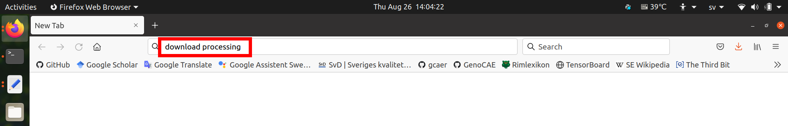

## 2. Väljer `https://processing.org/download`

Av sökresultat finns det riktiga hemsiden.

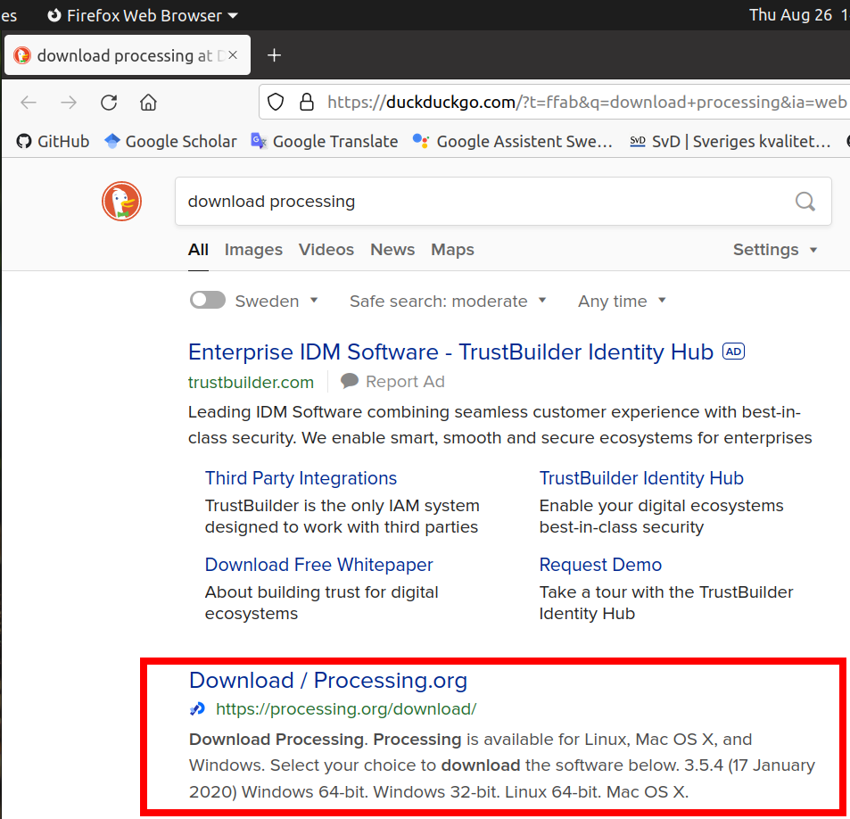

## 3. Klicka på 'Windows 64 bit'

Välje din operativ system. 
Antagligen har du Windows.
Har du Mac eller Linux, väljer detta fil.

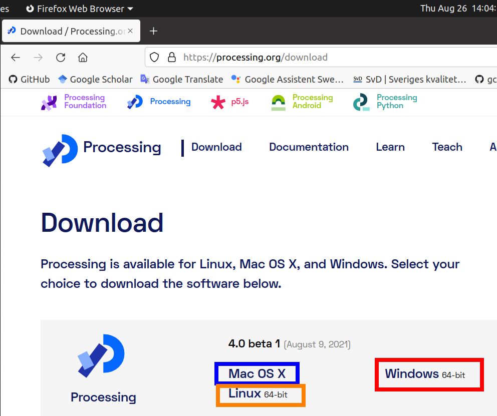

## 4. Ladda ner filen på din dator

Efter du har klickat på riktigen Processing version,
ladd ner filen (öppna ej filen!).

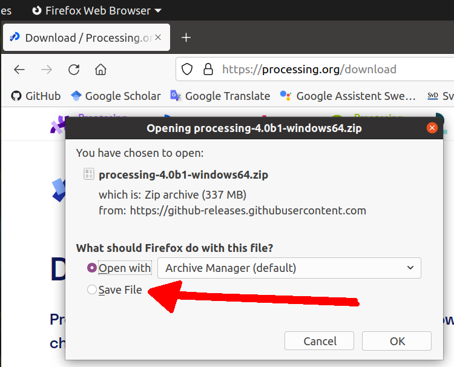

## 5. Spara filen i din favoritfolder, till exempel 'Mina dokument'

Spara filen på din dator i din favoritfolder, till exempel 'Mina dokument'.
I bilden här är 'Downloads' användet, men 'Mina dokument' vare bättre.

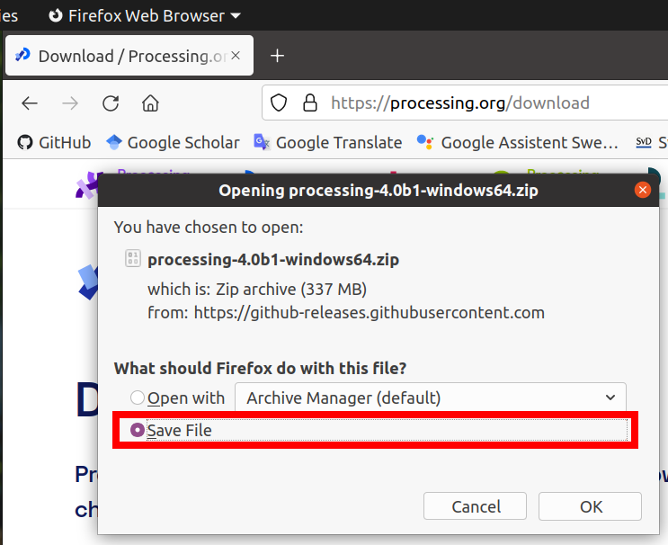

## 6. Vänta till filen är nedladdat

Det tar en tid före filen är nedladdat. Klockan vänta :-)

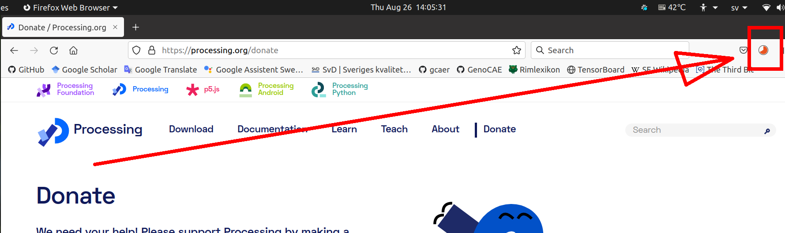

## 7. Packa upp filen

Nedladdad filen är en zip fil. 
En zip fil är en sammling av flera filer.
För Processing ät funkar, måsta du packa upp filen (att starta 
Processing här funkar inte).
En mapp ska bill gjört som börjar med 'processing-'.

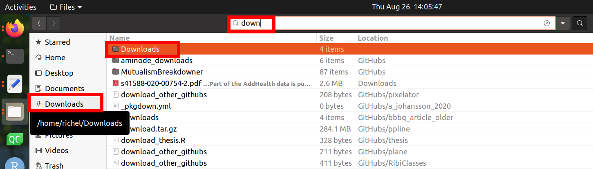

## 8. Dubbelklicka mapp

Dubbelklicka mapp som börjar med 'processing-'.

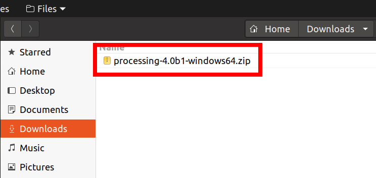

## 9. Dubbelklicka andra mapp

Här finns det en andra map som börjat också med 'processing-'.
Dubbelklicka den också.

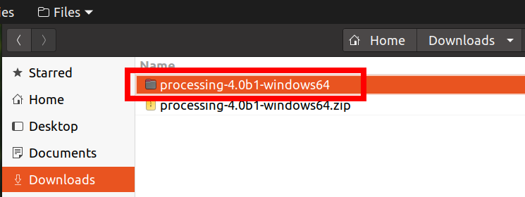

## 10. Klicka på Processing

Nu ser du många filer som är alla notvändig för Processing.
Klick pa 'Processing' för att startat Processing.

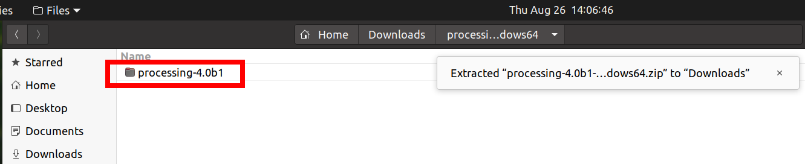

## 11. Windows bonus: gör an fillänk och flytt länken på skrivbord

På Windows, det är möjligt at gör an fillänk.
Flytt fillänk på skrivbord, så det är lätt at startar Processing!

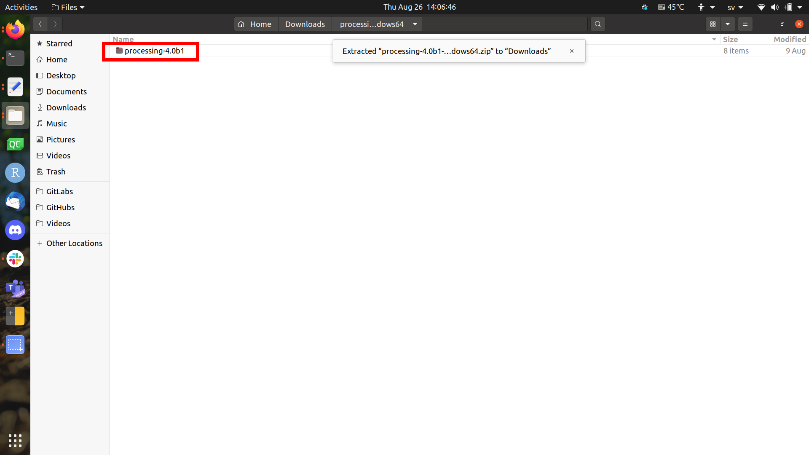

