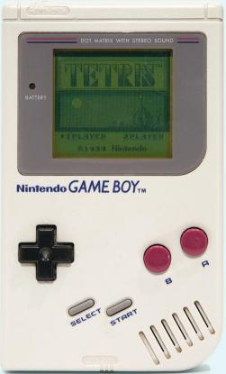

# `width` och `height`

Under den här lektionen lär du dig använda `width` och `height`.



\pagebreak

## `width` en `height`: intro

```c++
void setup() 
{
  size(256, 256);
}

void draw()
{
  ellipse(128, 128, 256, 256);  
}
```

| 
:---------------------:|:-----------------------------:
`size(800, 400);`      | 'Kära dator, gör ett fönster `800` pixlar brett och `400` pixlar högt.'
`ellips(60,50,40,30);` | 'Kära dator, rita ut en oval `60` pixlar till höger, `50` pixlar nedåt, som är `40` pixlar bred och `30` pixlar hög'

Skriv in koden ovan och kör den.


## `width` och `height`: uppgift 1


Gör nu fönstret `128` pixlar brett och `128` pixlar högt.

\pagebreak

## `width` och `height`: lösning 1

```c++
void setup() 
{
  size(128, 128);
}

void draw()
{
  ellipse(64, 64, 128, 128);  
}
```

## `width` och `height`


`width` och `height` är inbyggda i Processing,
`width` betyder fönsterbredd
och `height` betyder fönsterhöjd.
`width` och `height` är viktiga,
så att ditt program fortfarande ser bra ut när du ändrar storlek på skärmen.

Nu funkar våra program bara för ett fönster av en viss storlek.
Varje gång du väljer en ny fönsterstorlek måste du skriva in mycket kod igen!

Om vi vet fönstrets bredd och höjd vet vi också hur bred och hög vår oval måste bli:

 * ovalens x-koordinat (hur många pixlar till höger) är halva bredden
 * ovalens y-koordinat (hur många pixlar nedåt) är halva höjden
 * ovalens bredd är fönstrets bredd
 * ovalens höjd är fönstrets höjd


Processing känner till fönstrets bredd och höjd:
Fönstrets bredd kallas `width` och höjden kallas `height`

 | 
:-----------------:|:-----------------------------:
`width` | 'Kära dator, ange här hur många pixlar brett fönstret är.'
`height`| 'Kära dator, ange här hur många pixlar högt är fönstret.'

Dessa ord använder du om du vill veta 
storleken på ditt fönster.

\pagebreak

## `width` och `height`: uppgift 2


Skapa ett program som ritar en oval som fyller hela fönstret:

 * Ändra den första `64` till `width / 2`
 * Ändra den andra `64` till `height / 2`
 * Ändra den första `128` till `width`
 * Ändra den andra `128` till `height`

| 
:-----------------:|:-----------------------------:
`/` | 'delat med'

\pagebreak

## `width` och `height`: lösning 2

```c++
void setup() 
{
  size(128, 128);
}

void draw()
{
  ellipse(width / 2, height / 2, width, height);  
}
```

## `width` och `height`: uppgift 3


Rita ut cirkelns mitt på platsen (koordinat) `(0, 0)` i fönstret.

\pagebreak

## `width` och `height`: lösning 3

```c++
void setup() 
{
  size(128, 128);
}

void draw()
{
  ellipse(0, 0, width, height);  
}
```

## `width` och `height`: uppgift 4


Skapa en till cirkel vars mittpunkt ligger i det övre högra hörnet.
Använd `width` och/eller `height`.

\pagebreak

## `width` och `height`: lösning 4

```c++
void setup() 
{
  size(128, 128);
}

void draw()
{
  ellipse(0, 0, width, height);  
  ellipse(width, 0, width, height);  
}
```

## `width` och `height`: uppgift 5


Rita ut en tredje cirkel vars mittpunkt ligger i nedre vänstra hörnet.
Använd `width` och/eller `height`.

\pagebreak

## `width` och `height`: lösning 5

```c++
void setup() 
{
  size(128, 128);
}

void draw()
{
  ellipse(0, 0, width, height);  
  ellipse(width, 0, width, height);  
  ellipse(0, height, width, height);  
}
```

## `width` och `height`: slutuppgift


 * Gör fönstret 300 pixlar brett och 200 pixlar högt
 * Gör en fjärde cirkel vars mittpunkt ligger i nedre högra hörnet
 * Gör en femte cirkel vars mittpunkt ligger i mitten och är hälften så stor
 * Använd `width` och/eller `height` (ingen `100`, `150`,`200` eller `300`!)

